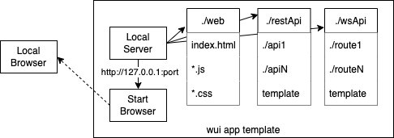

# wui-framework

wui-framework is used to create standalone cross-platform apps for macos, linux and windows. Apps are written as web apps using HTML, CSS, JavaScript and Nodejs. The user interface is displayed using an automatically launched local browser (the local default or other local, compatible browser). The deployed app executable is created with [pkg](https://www.npmjs.com/package/pkg).

Using a local browser for UI display has several advantages:
1. Small executable size. An [owntone](https://owntone.github.io/owntone-server/) playlist manager app is 66MB.
2. Improved compatibility over webview and proprietary renders since browsers are the defacto latest web UI standard and guaranteed to have the same features and render the same as cloud websites.
3. Ease of development. The app frontend uses standard web technologies and the (local) backend is nodejs + express static views, REST and websocket APIs.

[Atchitecture](#a®chitecture)

[Developing an app](#using)

[Building wui-app ](#building)

[Extending wui-app](#extending)

[License](#license)

# Architecture <a name="architecture"></a>



A wui app consists of a standard template that:
- Starts a local web server on some unused port.
- Finds and launches an installed browser aimed at the server's address (http://127.0.0.1:port). The local default browser is used, if it is compatible. Otherwise, some other installed, compatible browser is used.

The server looks for the web app components in well-known locations:
- ./web: index.html and all referenced JavaScript and CSS files.
- ./restApi: An API template and directories that implement each REST API. The implementation uses the Amazon Web Services (AWS) serverless application ([SAM](https://aws.amazon.com/serverless/sam/)) model. The template defines information about each API. Each API directory includes an ```app.js``` file that is the entry point for the API logic.
- ./wsApu: same as ./restApi except for websockets.

The SAM serverless lambda model provides a flexible, modular way to implement APIs. In SAM, lambdas have no persistant data and run in independent contexts. In a wui app, the lambdas are loaded via ```require``` into the same process and can use any nodejs data store or sharing method, e.g. ```global```.

# Developing an app <a name="using"></a>

Install the repo.

```
git clone git@github.com:boblund/wui-app.git
cd wui-app
npm install
```

A wui app is essentially a web site. The wui-app repo has ```web```, ```restApi``` and ```wsApi``` sub-directories that contain the app implementation:

- static web pages placed in the ```web``` directory. The entry point must be named ```index.html```. The names and structure of the other components are up to the app developer.
- optional REST API handlers are placed in the ```restApi``` directory which contains:
	- ```template.yaml``` that defines the set of API handlers:
		- ```CodeUri``` is the relative path to access that API handler, e.g. ```pageClose```
		- ```Handler``` is the 'handler function file name minus the extenstion'.'function_export', e.g. ```app.lambdaHandler```
</br></br>
	- a sub-directory for each API that contains the handler implementation, e.g. ```pageClose/app.js``` 
</br></br>
- optional websocket route handlers are placed in the ```wsApi``` directory which contains:
	- ```template.yaml``` that defines the set of route handlers:
		- ```CodeUri``` is the relative path to access that route's handler, e.g. ```send```
		- ```Handler``` is the file name (minus extenstion) and entry point of the handler, e.g. ```app.lambdaHandler```
</br></br>
	- a sub-directory for each API that contains the handler implementation. The websocket API requires handling websocket connect and disconnect whose ```CodeUri``` are ```onconnect``` and ```ondisconnect``` respectively. These handlers can do nothing except return a status code of 200.

REST API URLs are ``` `${window.location.href}/api/${name}` ``` where ```name``` is the name of the sub-directory in which that API is located.

# Building wui-app <a name="building"></a>

# Extending wui-app <a name="extending"></a>

```
├── browser
│   ├── findBrowser.js
│   ├── firefoxprofile
│   └── startBrowser.js
├── dist
│   └── wuiapp
├── package-lock.json
├── package.json
├── restApi
│   ├── methodDir
│   │   └── app.js
│   └── template.yaml
├── server
│   ├── ApiGw.js
│   ├── apiGwLambdas.js
│   ├── localdomain.cert
│   ├── localdomain.key
│   ├── restApiGw.js
│   ├── server.js
│   └── wsApiGw.js
├── web
│   ├── index.css
│   ├── index.html
│   └── index.mjs
├── wsApi
│   ├── onconnect
│   │   └── app.js
│   ├── ondisconnect
│   │   └── app.js
│   ├── send
│   │   └── app.js
│   └── template.yaml
└── wuiApp.js
```

# License <a name="license"></a>

Creative Commons Attribution-NonCommercial 4.0 International
